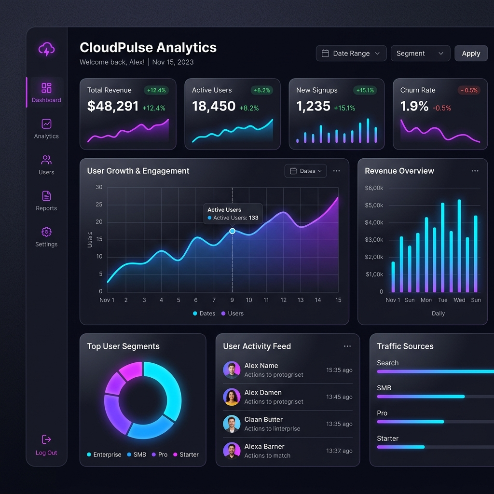
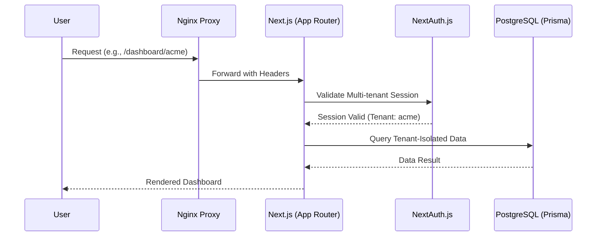

# 📊 SaaS Analytics Dashboard

A premium, multi-tenant SaaS Analytics Dashboard built with **Next.js 16**, **Prisma**, and **NextAuth.js**. Production-ready and fully dockerized.

---

## 🛑 The Problem
Building a SaaS dashboard today is complex. Developers often get bogged down by:
- **Data Isolation**: Ensuring multiple teams/tenants can't see each other's data.
- **Analytics Visualization**: Setting up performant, beautiful charts for raw data.
- **Deployment Overhead**: Wasting time on Nginx proxies, SSL, and Docker boilerplate.
- **Auth Complexity**: Handling session management across subdirectories or slugs.

## ✅ The Solution
This project provides a **battle-tested foundation** that solves these problems out of the box:
- **Hard Data Isolation**: Logic-driven organization slugs (e.g., `/dashboard/[slug]`) for strict multi-tenancy.
- **Modern Analytics**: Integrated Recharts components ready to consume your database metrics.
- **Dockerized Architecture**: Pre-configured Nginx and App containers for instant cloud deployment.
- **Edge-Ready Auth**: NextAuth.js configured with a Prisma adapter for seamless scaling.

---

## 🛠 Tech Stack


---

## 🖼️ Screenshots

### Dashboard Overview


---

## 🌐 Live Demo
> [!TIP]
> **View active demo here:** [https://your-demo-url.com](https://your-demo-url.com)  
> *(Replace the URL above with your actual deployment link)*

---

## 🏛 Architecture Overview

The system is designed for high availability and strict multi-tenant isolation. It uses an **Nginx** reverse proxy to handle production-grade routing and header management before requests reach the **Next.js** application.

### 🔄 Request Flow


### 🗝 Core Architectural Pillars
- **Strict Multi-tenancy**: Organization-based data isolation is managed via dynamic route slugs (`/dashboard/[slug]`).
- **Production Proxy**: An **Nginx** container acts as the entry point, providing security headers and request throttling.
- **ORM & Type Safety**: **Prisma** ensures a type-safe interface with the **PostgreSQL** database.

---

## 📦 Project Structure
- `src/app`: Next.js 16 App Router pages and API routes.
- `src/components`: UI components (Shadcn + custom Recharts).
- `src/lib`: Core utilities (Prisma client, Auth options, multi-tenant slugs).
- `prisma`: Database schema definition and migrations.
- `nginx`: Configuration for the production-grade reverse proxy.

---

## 🚀 Getting Started

### 1. Prerequisites
- Node.js (v20+)
- External PostgreSQL Database
- Docker & Docker Compose (optional, for production-like deployment)

### 2. Environment Setup
Copy the example environment file and fill in the values:
```bash
cp .env.example .env # If .env.example exists, otherwise create .env
```
Key variables required:
- `DATABASE_URL`: Connection string for PostgreSQL.
- `NEXTAUTH_SECRET`: Secret for session encryption.
- `NEXTAUTH_URL`: Base URL of the application.
- `GMAIL_USER`: Your Gmail address.
- `GMAIL_PASS`: Your Google App Password.

### 3. Local Development (Host Machine)
To run the project locally:
```bash
# Install dependencies
pnpm install

# Setup database schema
pnpm prisma generate
pnpm prisma db push

# Start the development server
pnpm dev
```
Open [http://localhost:3000](http://localhost:3000) for the application.

---

## 🐳 Docker Deployment

To deploy the application and reverse proxy (App + Nginx) using Docker:

### Build and Start
```bash
docker compose up -d --build
```
This will start:
- **app**: Next.js application (Multi-tenant logic).
- **nginx**: Reverse proxy handling requests on port 80.

### Useful Docker Commands
- `docker compose stop`: Stops the running services.
- `docker compose restart`: Restarts all services.
- `docker compose logs -f`: Tails logs for all services.
- `docker compose ps`: Lists status of all services.

---

## ⚠️ Important Notes
> [!IMPORTANT]
> The current Next.js version (16.2.2) uses the `App Router`. 

> [!WARNING]
> Ensure your `DATABASE_URL` in the `.env` file points to your external PostgreSQL database.

---

## 📄 License
MIT
